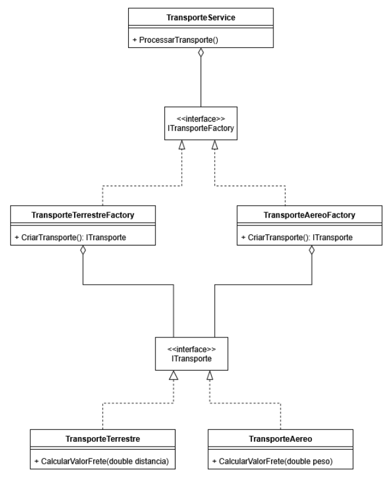

# Atividade avaliativa

## Questão 01

### Padrão utilizado: Factory Method

### Justificativa

Decidi utilizar o factory method pois é o que mais se adequa ao problema proposto. Com o factory method é possível lidar com múltiplos tipos de transportes, sendo possível definir uma lógica para cada tipo de maneira flexível e escondendo a lógica de criação do usuário permitindo o tratamento de forma genérica do objeto por conta da interface IPagamento.

Link para a pasta: [Clique aqui](https://github.com/gustavogogola91/AtividadeAvaliativaPadroesDeProjetos/tree/master/Questao1)

### Diagrama

## Questão 2

### Padrão utilizado: Factory method

### Justificativa

Decidi utilizar o factory nesta questão também pelo mesmo motivo, permite a criação dos objetos sem se preocupar com sua configuração, apenas solicita e recebe o objeto pronto para uso.

Link para a pasta: [Clique aqui](https://github.com/gustavogogola91/AtividadeAvaliativaPadroesDeProjetos/tree/master/Questao2)

### Diagrama

## Questão 3

## Padrão utilizado: Observer

### Justificativa

O unico padrão de projeto que se encaixa neste problema é o observer, que permite notificar todos os objetos que se "inscreverem" para receber notificões de alterações em um objeto "observado".
O Objeto tópico é o observado e o Usuario é o Observador

Link para a pasta: [Clique aqui](https://github.com/gustavogogola91/AtividadeAvaliativaPadroesDeProjetos/tree/master/Questao3)